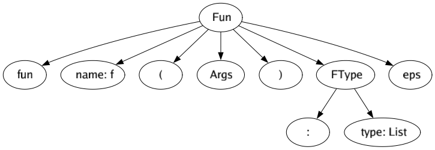

# Парсер заголовка функции в Kotlin
Заголовок начинается ключевым словом `fun`, далее идет имя функции, скобка,
несколько описаний аргументов через запятую, затем может идти двоеточие
и имя возвращаемого типа. Используйте один терминал для всех имен переменных.
Используйте один терминал для ключевых слов fun и т. п. (не несколько 'f', 'u', 'n')

Пример: `fun printSum(a: List<Int>, b: Int = 0): Unit`

## Грамматика

```
Fun    -> "fun " name "(" Args ")" FType
FType  -> ":" Type | eps
Type   -> type Gen
Gen    -> "<" Type ">" | eps
Arg    -> name ":" Type
Args   -> Arg Tail | eps
Tail   -> "=" value DefArg | "," Arg Tail | eps
DefArg -> "," Arg "=" value DefArg | eps 
```

Как можно заметить, в построенной грамматике нет ни левых рекурсий, ни правых ветвлений.

| Нетерминал | Описание                                                |
|------------|---------------------------------------------------------|
| Fun        | Заголовок функции в Kotlin                              |
| FType      | Тип функции, возможно, пустой                           |
| Type       | Тип                                                     |
| Gen        | Генеричная часть типа, может быть пустой                |
| Arg        | Аргумент, состоящий из имени и типа                     |
| Args       | Набор аргументов функции, возможно, пустой              |
| Tail       | Продолжение набора аргументов функции, возможно, пустое |
| DefArg     | Набор дефолтных аргументов функции, возможно, пустые    |

Теперь можно найти множества FIRST и FOLLOW для нетерминалов нащей грамматики:

| Нетерминал | FIRST     | FOLLOW             |
|------------|-----------|--------------------|
| Fun        | "fun"     | eps                |
| FType      | ":", eps  | eps                |
| Type       | type      | ">", ",", "=", eps |
| Args       | name, eps | "," ")"            |
| ArgTail    | ",", eps  | "," ")"            |

## Тестики!

Давайте посмотрим, что выдаст наш парсер на следующий ввод:

```
fun funName(argName : argType) : returnType
```

Получаем следующую схему разбора:




Всё именно так, как мы надеялись.
